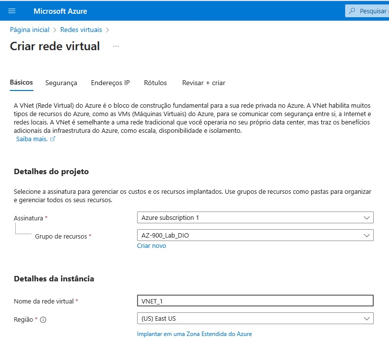

# Modelo de Previsão com Pontos de Extremidade

Este repositório contém o resumo das lições aprendidas durante o desenvolvimento do lab na DIO

1. Acesse a página inicial da azure no link: https://portal.azure.com, e busque por "Grupos de recursos".

 

2. Na nova aba clique em "Criar" no menu de opções, para criar um novo grupo de recursos. Em "Grupos de recursos", dê um nome ao grupo.

 

3. Revise tudo e clique no botão "Examinar + criar" na lateral inferior esquerda

 

4. Após ser redirecionado, deve aparecer um novo grupo.

 

5. Volte a página inicial da azure no link: https://portal.azure.com, e busque por "Redes virtuais".

 

6. Na nova aba clique em "Criar" no menu de opções, para criar um nova rede virtual. Em "Redes virtuais", dê um nome a rede.

 

7. Avance e será gerada automaticamente um endereço para rede.

 

8. Revise tudo e clique no botão "Examinar + criar" na lateral inferior esquerda

 

9. Após ser redirecionado, deve aparecer uma nova rede.

 

10. Volte a página inicial da azure no link: https://portal.azure.com, e busque por "Grupos de recursos".

 

11. Clique no grupo de recursos criado e verá a nova rede associada.

 