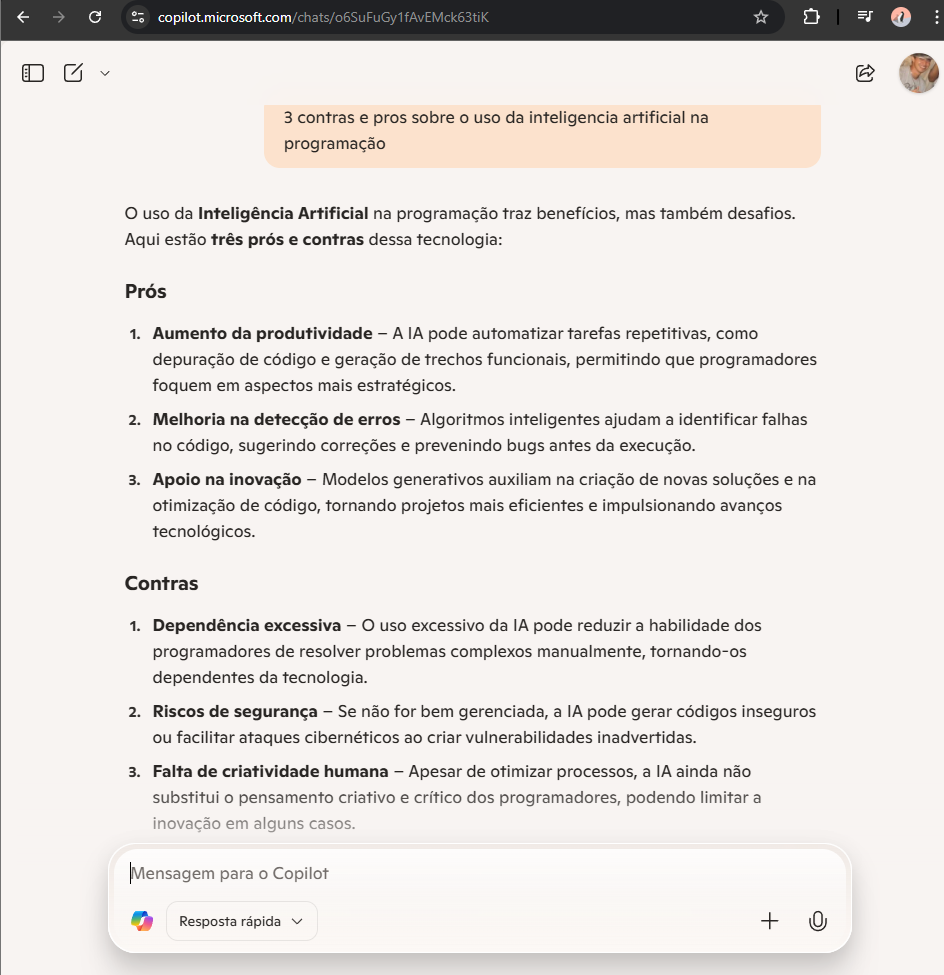
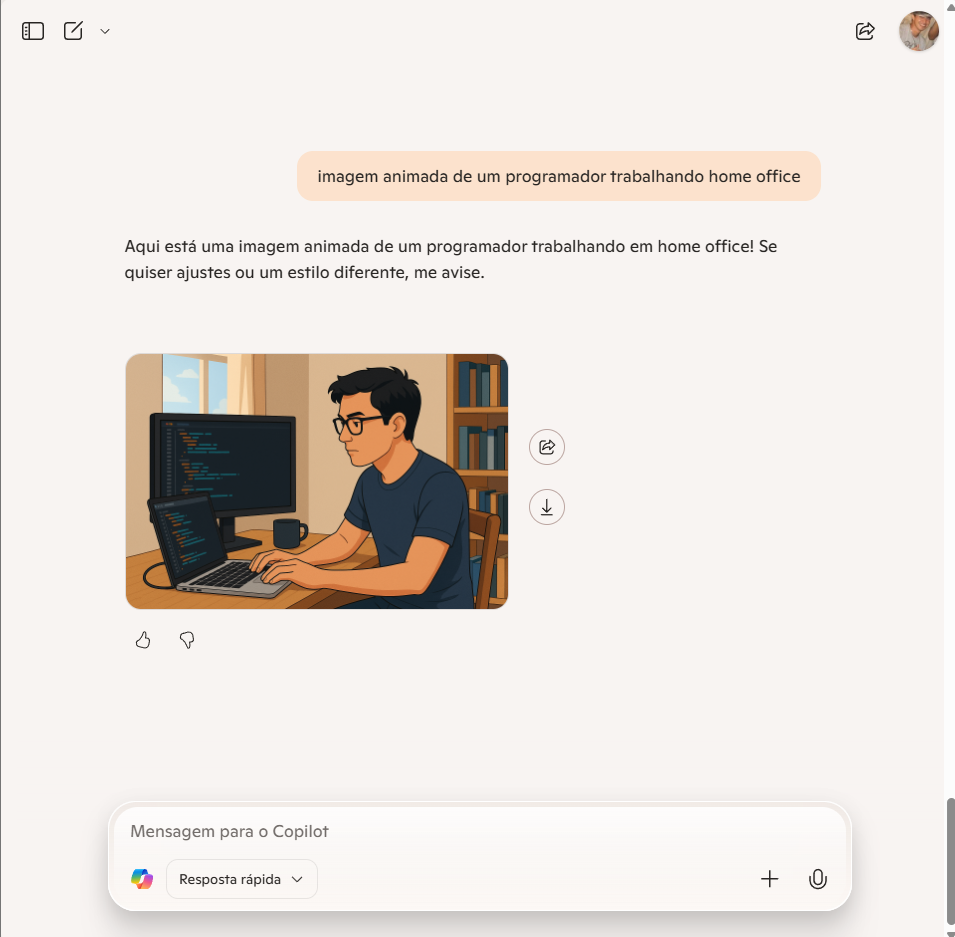
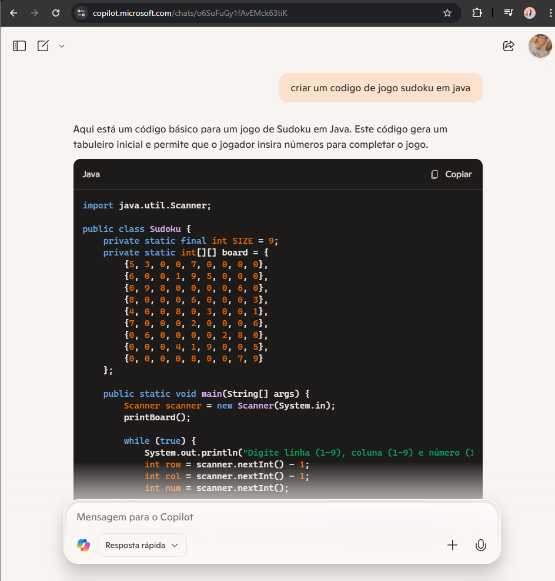
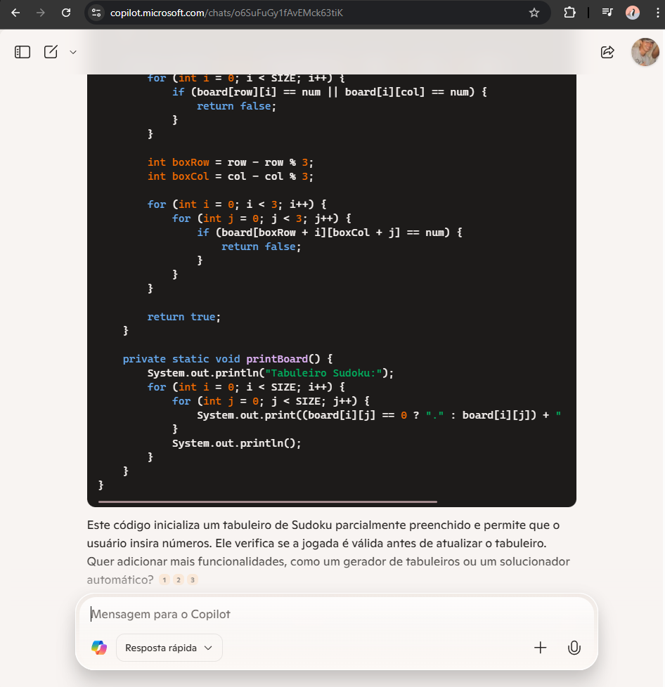

# Explorando os Recursos de IA Generativa com Copilot e OpenAI

## Introdução

**Inteligência Artificial Generativa (IA generativa)** é um ramo da IA que se concentra na criação de conteúdos originais, como textos, imagens, músicas e até vídeos. Ao contrário de sistemas tradicionais que apenas analisam e respondem a perguntas com base em dados existentes, a IA generativa utiliza modelos avançados de aprendizado de máquina para produzir novos conteúdos a partir de padrões e exemplos anteriores.

Ela tem aplicações em diversas áreas, desde a criatividade e entretenimento até negócios e ciência. Exemplos incluem assistentes de escrita, geradores de imagens a partir de descrições textuais e até ferramentas que auxiliam na composição musical. Essa tecnologia está revolucionando a forma como interagimos com computadores e expandindo as possibilidades da criação digital.

1. **Criatividade e Entretenimento**: 
Na arte digital, a IA permite que artistas explorem novas formas de expressão ao gerar ilustrações e pinturas a partir de descrições textuais. No cinema e na literatura, ela ajuda na criação de roteiros, diálogos e até efeitos visuais sofisticados. Além disso, na música, softwares generativos podem compor melodias originais e adaptar estilos conforme a necessidade do artista.

2. **Negócios e Ciência**: 
Empresas utilizam IA para criar conteúdos automáticos, desde textos publicitários até posts para redes sociais. Na ciência, pesquisadores aproveitam algoritmos generativos para simular experimentos, prever tendências e analisar grandes volumes de dados, acelerando descobertas em áreas como biotecnologia e física.

3. **Assistentes de Escrita**: 
Esses sistemas ajudam escritores e profissionais a gerar textos coerentes e criativos, sugerindo ideias, corrigindo gramática e até adaptando o estilo conforme o público-alvo. Eles também podem produzir resumos, artigos acadêmicos e materiais educativos de maneira ágil.

4. **Processamento de linguagem natural (NLP)**: 
No processamento de linguagem natural (NLP), a IA possibilita interações cada vez mais naturais, ajudando na redação de textos, tradução automática, geração de resumos e análise de sentimentos em mensagens ou redes sociais.

5. **Geradores de Imagens a partir de Descrições Textuais**: 
Ferramentas como essa permitem criar imagens únicas apenas com palavras, explorando desde ilustrações artísticas até conceitos para design e arquitetura. Elas são úteis para criadores de conteúdo, empresas de marketing e desenvolvedores de jogos.

6. **Ferramentas para Composição Musical**: 
A IA pode gerar harmonias, ritmos e melodias que se encaixam em diferentes gêneros musicais. Além disso, auxilia na produção de trilhas sonoras e personalização de músicas para vídeos e projetos audiovisuais.

Utilizei a IA generativa para gerar respostas de texto, imagens e código com o Microsoft Copilot.

Esses experimentos foram baseados nos guias da Microsoft Learn. Para informações mais detalhadas, consulte a página [Explore generative AI with Microsoft Copilot](https://microsoftlearning.github.io/mslearn-ai-fundamentals/Instructions/Labs/12-generative-ai.html). Esse readme foi escrito com auxílio de uma IA generativa.

## Procedimento
Para realizar os experimentos aquí mostrados basta acessar o [Microsoft Copilot](https://copilot.microsoft.com), realizar o *login* com uma conta Microsoft e começar a utilizar o *prompt*.

  

O primeiro teste foi pedir à IA que gerasse 3 contras e prós sobre o uso da inteligencia artificial na programação.

  

O segundo teste foi a geração de uma imagem animada de um programador home office.

  

O terceiro teste foi criar código de maneira automatizada de um codigo de um jogo sudoku em java.

  

  

## Conclusão e Insights
A Inteligência Artificial (IA) está transformando profundamente a maneira como interagimos com tecnologia, impulsionando avanços em diversas áreas, da criatividade ao setor empresarial. Seu impacto na produtividade, inovação e automação é inegável, trazendo soluções mais eficientes e acessíveis. No entanto, junto aos benefícios, surgem desafios, como a necessidade de regulamentação, ética no uso dos dados e equilíbrio entre a automação e a criatividade humana.

À medida que a IA evolui, seu papel na sociedade se torna cada vez mais relevante. O futuro dessa tecnologia dependerá de como será integrada de forma responsável, garantindo que seja uma aliada da inovação e do desenvolvimento humano. O potencial é imenso, e o que nos resta é aprender a utilizá-la da melhor forma possível.