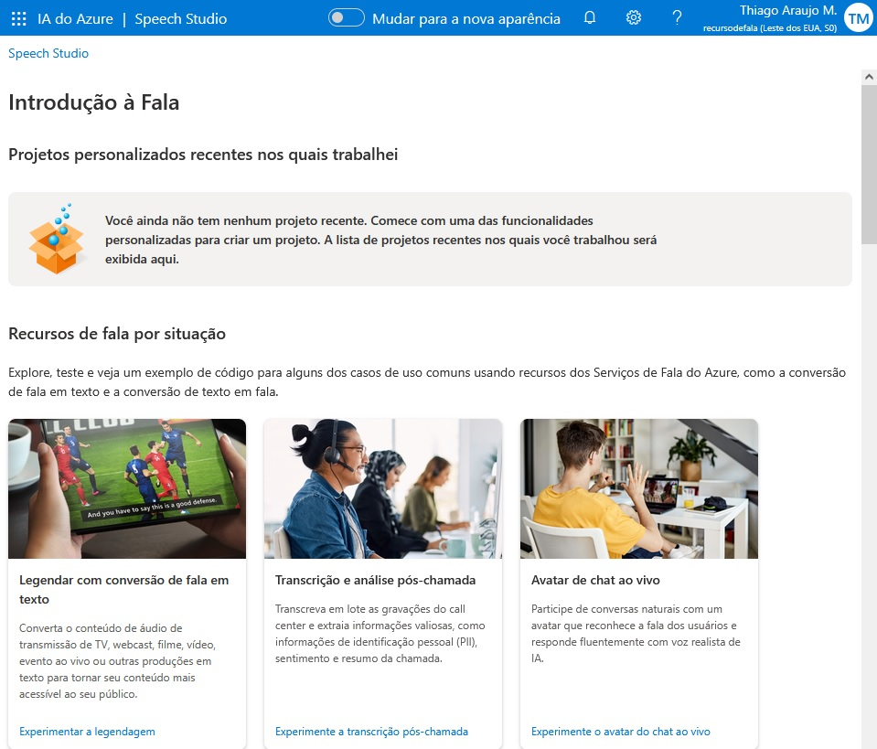
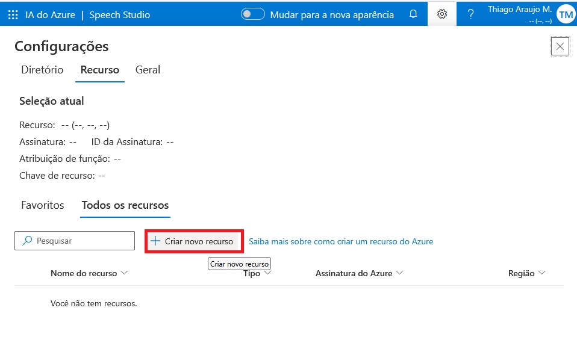
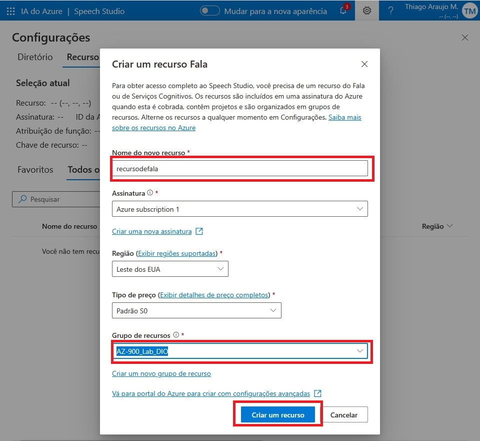
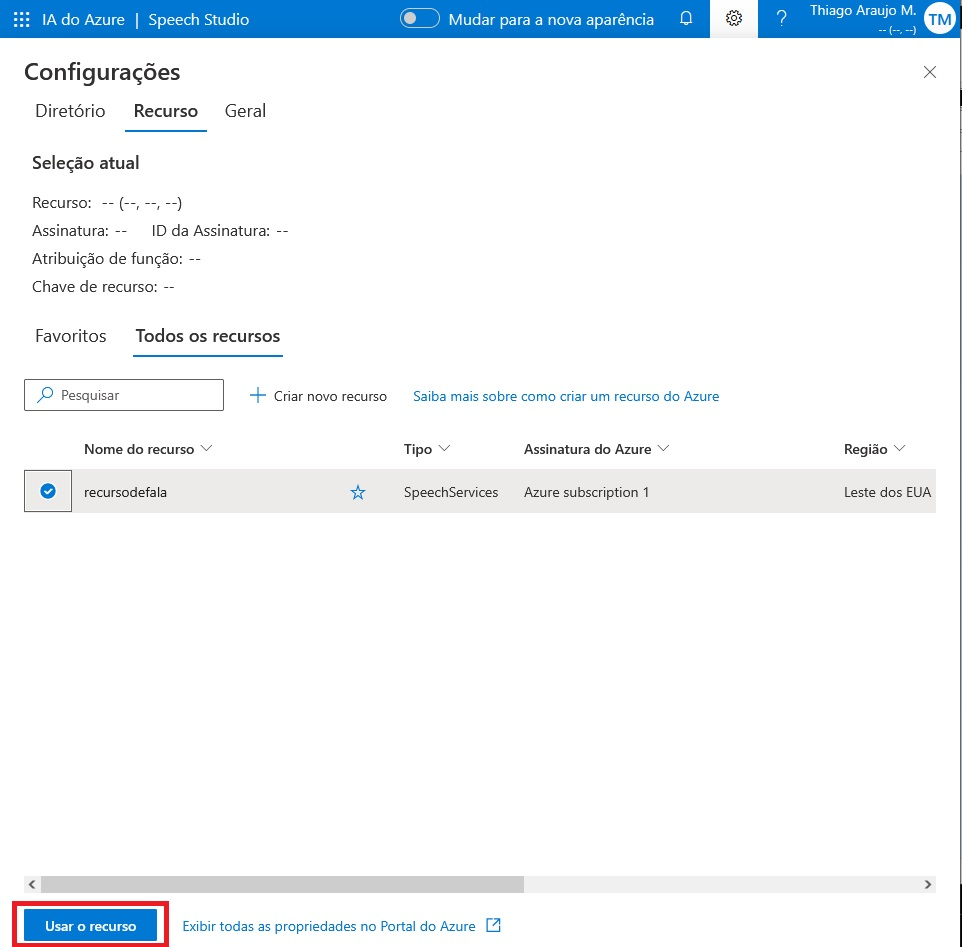
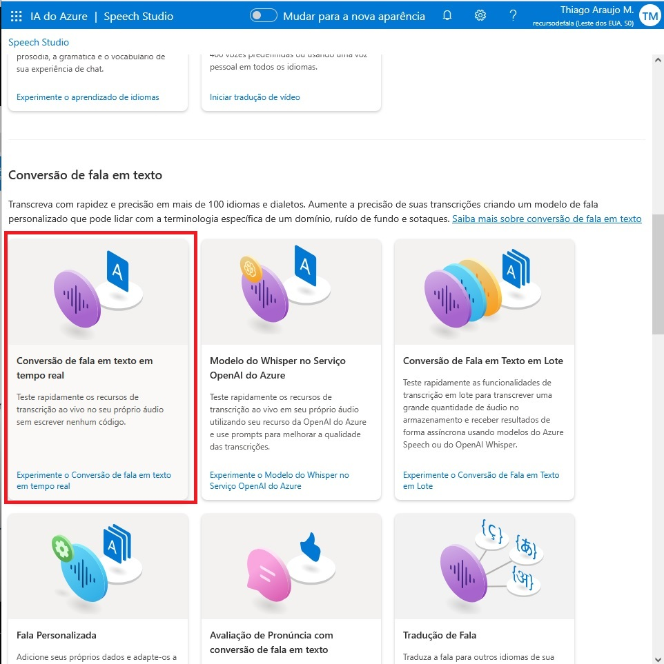
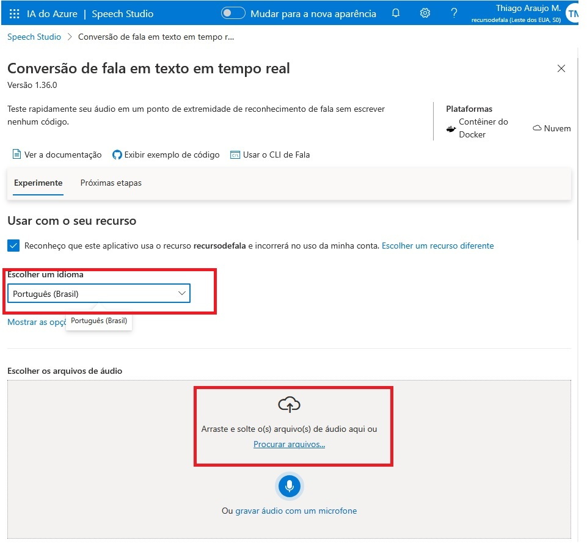
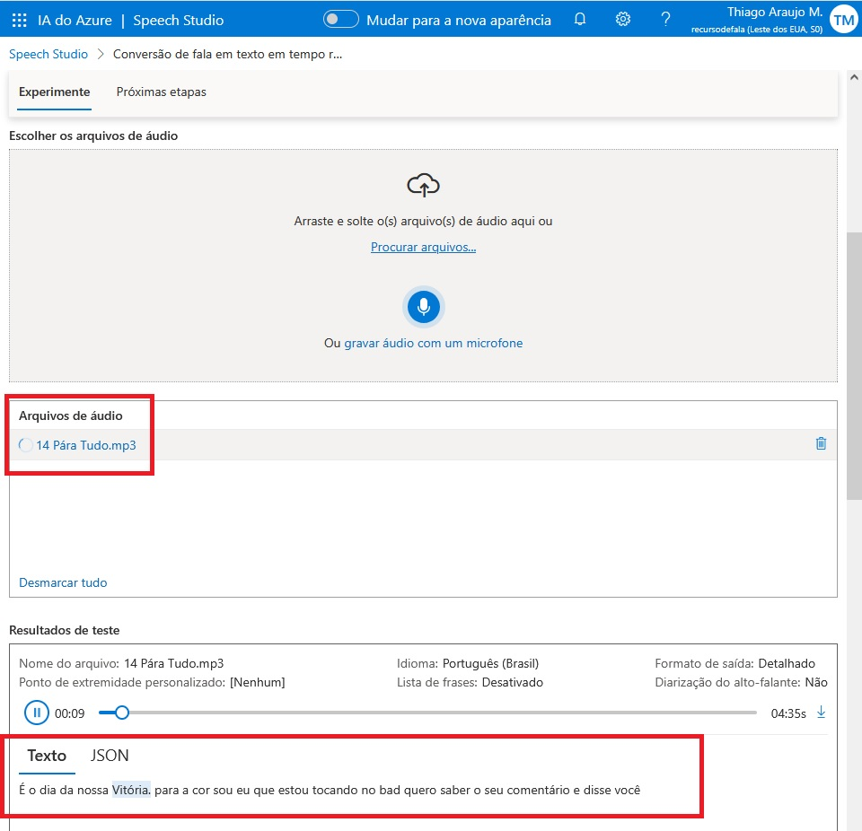
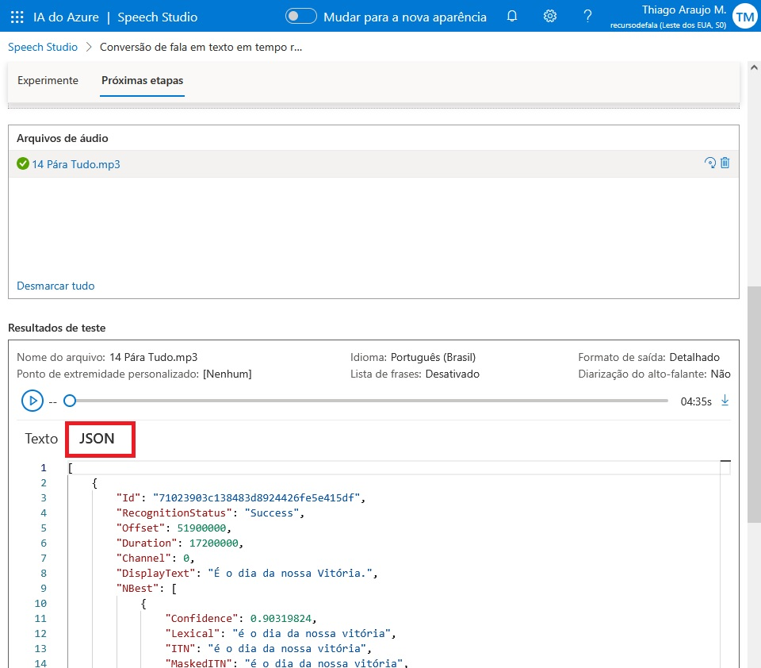

# Transcrição de Áudio em Texto no Speech Studio

1. Acessar a página inicial do Speech Studio no link: https://speech.microsoft.com/portal, e clicar no ícone de configurações na lateral da barra de navegação.

 

2. Se você não tiver nenhum recurso criado anteriormente, crie um novo no botão "+ Criar novo recurso".

 

3. Para criar um novo recurso, primeiro defina um nome a ele. Selecione um grupo de recursos. E por fim clique em "Criar um recurso".

 

4. Selecione o recurso criado na checkbox a esquerda do nome dele. E aperte em "Usar o recurso". 

 

5. Descendo a tela, temos a seção "Conversão de fala em texto", clique no card "Conversão de fala em texto em tempo real".  

 

6. Clique no checkbox para reconhecer o uso de recursos e escolha o idioma do áudio que será testado e escolha um áudio do seu computador ou gravar um na hora.

 

7. Em "Arquivos de áudio" temos os áudios que foram transcritos, e em "Resultados de teste" na seção "Texto" temos a transcrição do áudio em tempo real.

 

9. Na seção "JSON" ele mostra o código do áudio em formato de JSON.
