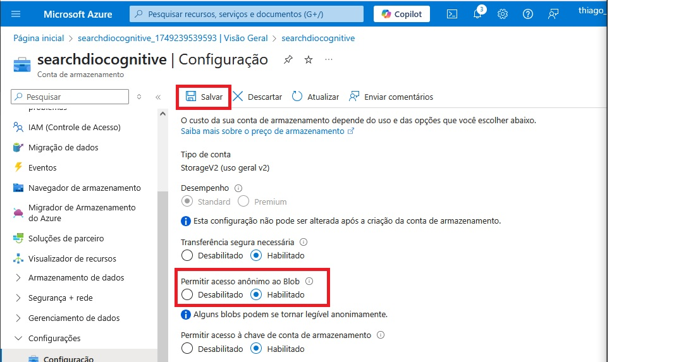
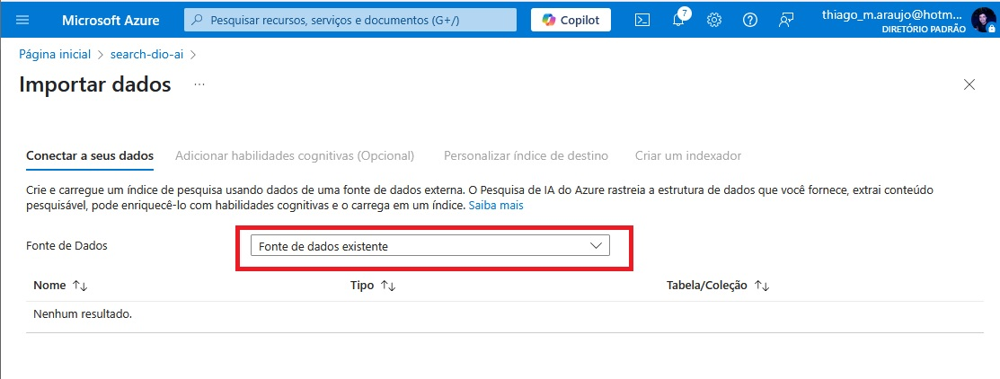

# Buscas-Cognitivas-Azure-IA

1. Acesse a página inicial da azure no link: https://portal.azure.com, pesquise por "Azure AI Search" no buscador e clique em "Pesquisa de IA".

 

2. Na nova aba clique em "Criar" no menu de opções, para criar um novo recurso de pesquisa.

 

3. Em "Detalhes do projeto", não altere a opção de assinatura. Em "Grupo de recursos" escolha um já criado ou crie um novo no botão abaixo "Criar novo".

 

4. Descendo a tela, temos os detalhes da instância, coloque um nome de sua preferência. É recomendado não utilizar servidores da região do Brasil, por questões de instabilidade, aqui utilize a já indicada pela Azure ou "West US 2". Em "Camada de preço" clique na opção "Alterar o Tipo de preço".

 

5. Clique na opção "Basico" e depois clique em "Selecionar".

 

6. Revise tudo e clique no botão "Revisar + criar" na lateral inferior esquerda

 

7. Você será redirecionado a outra página com os termos, clique em "Criar" na lateral inferior esquerda

 

8. Após ser redirecionado, deve aparecer um card de exito. Volte a tela inicial da Azure.

 

9. Clique em "Criar um recurso".

 

10. No menu de opções na lateral esquerda, clicar em "IA + Machine Learning".

 

11. Na opção "Serviços Cognitivos" clicar em "Criar".

 

12. Em "Detalhes do projeto", não alterar a opção de assinatura. Em "Grupo de recursos" escolha um já criado ou crie um novo no botão abaixo "Criar novo".

 

13. Descendo a tela, temos os detalhes da instância, é recomendado não utilizar servidores da região do Brasil, por questões de instabilidade, aqui utilize a já indicada pela Azure ou "East US". Em "Nome" coloque um nome de sua preferência. Em "Tipo de preço" escolha a opção padrão (Standard S0). E confirme a checkbox sobre os preços abaixo.  

 

14. Revise tudo e clique no botão "Examinar + criar" na lateral inferior esquerda

 

15. Você será redirecionado a outra página com os termos, clique em "Criar" na lateral inferior esquerda

 

16. Após ser redirecionado, deve aparecer um card de exito. Volte a página inicial da Azure.

17. Pesquise por "Storage Account" no buscador e clique em "Contas de armazenamento".

 

18. Clique em "Criar" na aba de opções para criar uma nova conta de armazenamento.

 

19. Em "Detalhes do projeto", não altere a opção de assinatura. Em "Grupo de recursos" escolha um já criado ou crie um novo no botão abaixo "Criar novo".

 

20. Descendo a tela, temos os detalhes da instância, coloque um nome de sua preferência. É recomendado não utilizar servidores da região do Brasil, por questões de instabilidade, aqui utilize a já indicada pela Azure ou "East US". Em "Desempenho" selecione a opção "Standard", em "Redundância" esolha a opção "LRS". Por fim clique em "Examinar".

 

21. Examine tudo e clique em "Criar".

 

22. Após ser redirecionado, deve aparecer um card de exito. Clique no botão "Ir para o recurso".

 

23. Na barra de navegação lateral, encontre a opção "Configuração" e clique nela.

 

24. Habilite a opção "Permitir acesso anônimo ao Blob" e clique em Salvar na barra de opções.

 

25. Na barra de navegação lateral, encontre a opção "Contêineres" e clique nela.

 

26. CLique em "Contêiner" para criar um novo Contêiner.

 

27. No campo "Nome", escolha um nome de sua preferência. No campo "Nível de acesso anônino" escolha a opção "Contêiner". E por fim clique em "Criar".

 

28. Acesse a documentação oficial da Microsoft em: https://aka.ms/ai900-ai-search. Vá até a seção "Carregar documentos para o armazenamento do Azure"

 

29. Encontre a seção 4 do tópico e aperte no link "avaliações de café compactadas", ele deve iniciar um download no seu navegador, abra a pasta após concluir o download no seu explorador de arquivos.

 

30. Descompacte a pasta, volte a Azure e selecione o contêiner criado.

 

31. Clique em "Carregar" e faça upload da pasta baixada.

 

32. Confirme a inserção dos arquivos clicando em "Carregar".

 

33. Volte ao mecânismo de busca criado anteriormente.

 

34. Clique em "Importar dados".

 

35. Ao abrir o import de dados selecione a opção "Armazenamento de Blob do Azure".

 

36. Na seção "Conectar a seus dados", mantenha a "Fonte de Dados", dê um nome de sua escolha a fonte de dados, mantenha a opção "Contéudo e metadados" em "Dados para extrair", em "Modo de análise" mantenha o padrão e por fim clique em "Escolher uma conexão existente" para o campo "Cadeia de conexão".

 

37. Ele deve exibir a cadeia criada anteriormente, selecione e clique em "Selecionar".

 

38. Ele deve se autocompletar após selecionar o armazenamento criado.

 

39. Continuando, em "Autenticação de identidade gerenciada" escolha "Nenhum", em "Nome do contêiner" escolha o contêiner criado, não é necessário preencher "Pasta de blobs" nem "Descrição" (Opcional). Por fim clique em "Próximo: Adicionar habilidades cognitivas (opcional)".

 

40. Expanda a seção "Adicionar enriquecimentos".

 

41. Defina um nome de sua escolha, habilite a checkbox para habilitar o OCR. Certique-se que a opção marcada para "Campos de dados de origem" esteja em "merged_content". E em "Nível de granulidade do enriquecimento" escolha a opção "Páginas (parte de caracteres de 5000)". Deixe "Habilitar o enriquecimento incremental" em branco.

 

42. Continuando, em "Habilidades Cognitivas de Texto", assinale as opções: "Extrair nomes de localização", "Extrair frases-chave" e "Detectar sentimento". Em "Habilidades Cognitivas de Imagem", assinale todas as opções.

 

43. Continue para a seção "Salvar os enriquecimentos em um repositório de conhecimento", escolha "Escolher uma conexão existente".

 

44. Escolha uma conta de armazenamento existente.

 

45. Selecione o contâiner criado.

 

46. Assinale todas as opções (o nome do contêiner será preenchido automáticamente), por fim clique em "Próximo: Personalizar índice de destino".

 

47. Na seção "Personalizar índice de destino", defina o nome de sua escolha, em "Chave" defina como "metadata_storage_path", deixe a opção "Nome do sugestor" em branco e deixe a opção "Modo de busca" como está.

 

48. Abaixo, selecione todos os campos já selecionados como "Filtrável" e clique em "Próximo: Criar um indexador".

 

49. Na seção "Criar um indexador", defina um nome de sua preferência e em agenda escolha "Uma vez".

 

50. Expanda a seção "Opções avançadas", assinale a opção "Chaves de Codificação de Base 64" e clique em "Enviar".

 

51. Voltando no recurso do serviço de pesquisa, em "Gerenciador de pesquisa".

 

52. Faça uma busca clique em "Pesquisar" e veja que na seção "Resultado", temos a resposta da pesquisa em um formato JSON.

 