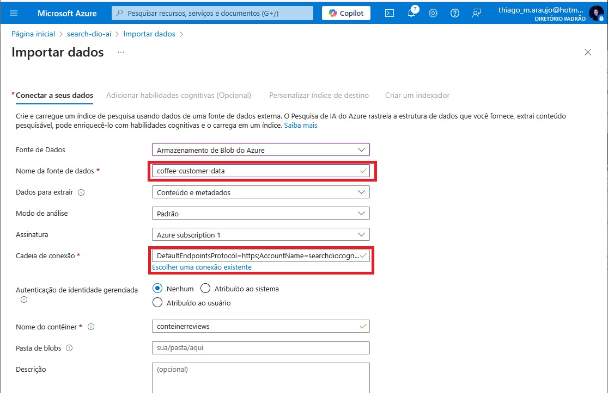

# Buscas-Cognitivas-Azure-IA

1. Acesse a página inicial da azure no link: https://portal.azure.com, pesquise por "Azure AI Search" no buscador e clique em "Pesquisa de IA".

 

2. Na nova aba clique em "Criar" no menu de opções, para criar um novo recurso de pesquisa.

 

3. Em "Grupo de recursos" escolha um já criado ou crie um novo no botão abaixo "Criar novo". Dê um nome ao serviço, utilize a já indicada pela Azure e clique em "Alterar o Tipo de Preço".

 

4. Clique na opção "Basico" e depois clique em "Selecionar".

 

5. Após ser redirecionado, deve aparecer um card de exito. Volte a tela de serviços..

 

6. Clique no serviço de pesquisa. 

 

7.Clique em "Criar um recurso".

 

8. No menu de opções na lateral esquerda, clicar em "IA + Machine Learning".

 

9. Clique em "Azure AI services" para cria o serviço.

 

10. Em "Grupo de recursos" escolha um já criado ou crie um novo, dê um nome ao serviço, escolha Standard SO para o "Pricing tier", marque o checkbox em View full pricing details e clique no botão abaixo "Examinar e Criar".

 

11. Confira tudo e clique em "Criar".

 

12. Após ser redirecionado, deve aparecer um card de exito. Clique no botão "Ir para o recurso".

 

13. Pesquise por "Storage Account" no buscador e clique em "Contas de armazenamento".  

 

14. Clique em "Criar" na aba de opções para criar uma nova conta de armazenamento.

 

15. Em "Grupo de recursos" escolha um já criado ou crie um novo no botão abaixo "Criar novo". Em detalhes da instância, coloque um nome. Utilize a região indicada pela Azure ou "East US". Em "Desempenho" selecione a opção "Standard", em "Redundância" esolha a opção "LRS". Por fim clique em "Examinar e Criar".

 

16. Examine tudo e clique em "Criar".

17. Após ser redirecionado, deve aparecer um card de exito. Clique no botão "Ir para o recurso".

 

18. Na barra de navegação lateral, encontre a opção "Configuração" e clique nela.

 

19. Habilite a opção "Permitir acesso anônimo ao Blob" e clique em Salvar na barra de opções.

 

20. Na barra de navegação lateral, encontre a opção "Contêineres" e clique nela.

 

21. CLique em "Adicionar Contêiner" para criar um novo Contêiner. No campo "Nome", escolha um nome de sua preferência. No campo "Nível de acesso anônino" escolha a opção "Contêiner". E por fim clique em "Criar".

 

22. Acesse a documentação oficial da Microsoft em: https://aka.ms/ai900-ai-search. Vá até a seção "Carregar documentos para o armazenamento do Azure" Encontre a seção 4 do tópico e aperte no link "avaliações de café compactadas", ele deve iniciar um download no seu navegador, abra a pasta após concluir o download no seu explorador de arquivos. Descompacte a pasta, volte a Azure e selecione o contêiner criado. Clique em "Carregar" e faça upload da pasta baixada.

 

23. Volte ao mecânismo de busca criado anteriormente.

 

24. Clique em "Importar dados".

 

25. Ao abrir o import de dados selecione a opção "Armazenamento de Blob do Azure".

 

26. Escolha o container que foi criado.

 

27. Na seção "Conectar a seus dados", mantenha a "Fonte de Dados", dê um nome de sua escolha a fonte de dados, mantenha a opção "Contéudo e metadados" em "Dados para extrair", em "Modo de análise" mantenha o padrão e por fim clique em "Escolher uma conexão existente" para o campo "Cadeia de conexão". Ele deve exibir a cadeia criada anteriormente, selecione e clique em "Selecionar". Ele deve se autocompletar após selecionar o armazenamento criado. Continuando, em "Autenticação de identidade gerenciada" escolha "Nenhum", em "Nome do contêiner" escolha o contêiner criado, não é necessário preencher "Pasta de blobs" nem "Descrição" (Opcional). Por fim clique em "Próximo: Adicionar habilidades cognitivas (opcional)".

 

28. Expanda a seção "Adicionar enriquecimentos". Defina um nome de sua escolha, habilite a checkbox para habilitar o OCR. Certique-se que a opção marcada para "Campos de dados de origem" esteja em "merged_content". E em "Nível de granulidade do enriquecimento" escolha a opção "Páginas (parte de caracteres de 5000)". Deixe "Habilitar o enriquecimento incremental" em branco.

 

29. Continuando, em "Habilidades Cognitivas de Texto", assinale as opções: "Extrair nomes de localização", "Extrair frases-chave" e "Detectar sentimento". Em "Habilidades Cognitivas de Imagem", assinale todas as opções. Continue para a seção "Salvar os enriquecimentos em um repositório de conhecimento", escolha "Escolher uma conexão existente".

 

30. Escolha uma conta de armazenamento existente.

 

31. Selecione o contâiner criado.

 

32. Assinale todas as opções (o nome do contêiner será preenchido automáticamente), por fim clique em "Próximo: Personalizar índice de destino".

 

33. Na seção "Personalizar índice de destino", defina o nome de sua escolha, em "Chave" defina como "metadata_storage_path", deixe a opção "Nome do sugestor" em branco e deixe a opção "Modo de busca" como está. Abaixo, selecione todos os campos já selecionados como "Filtrável" e clique em "Próximo: Criar um indexador".

 

35. Na seção "Criar um indexador", defina um nome de sua preferência e em agenda escolha "Uma vez" e clique em "Enviar".

 

36. Voltando no recurso do serviço de pesquisa, em "Explorador de pesquisa".

 

37. Faça uma busca clique em "Pesquisar" e veja que na seção "Resultado", temos a resposta da pesquisa em um formato JSON.

 
